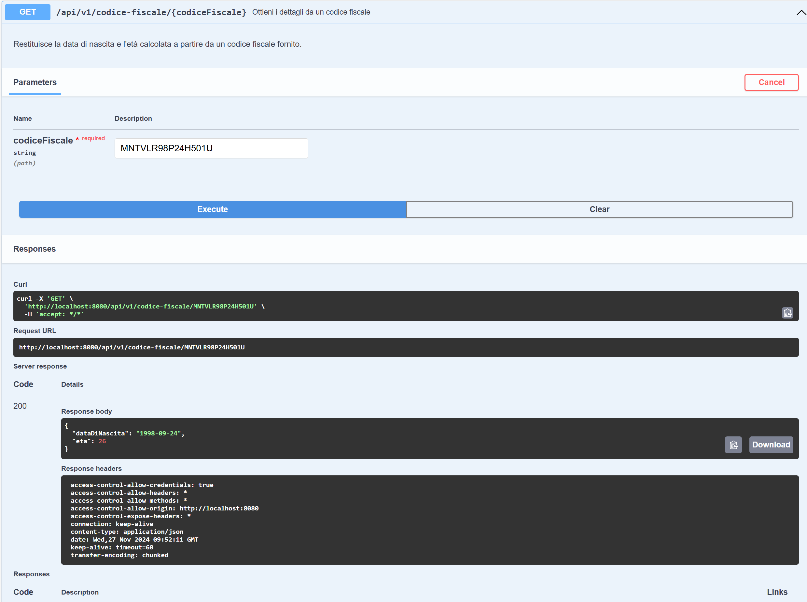

Progetto Codice Fiscale API

Questo progetto è un'API REST sviluppata con Spring Boot, che consente di ottenere informazioni dettagliate a partire da un codice fiscale italiano. 

Nello specifico, l'API restituisce la data di nascita e l'età calcolata sulla base del codice fiscale fornito come input.

La documentazione dell'API è generata automaticamente utilizzando Swagger (Springdoc OpenAPI), rendendo facile l'interazione e il test delle funzionalità esposte.

